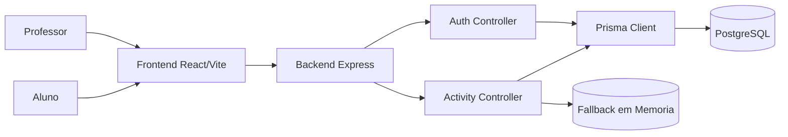

# Arquitetura - EduFlow

Este documento descreve a arquitetura do MVP EduFlow para suporte ao relatorio tecnico do hackathon.

## 1) Visao Geral

O sistema e dividido em duas aplicacoes:

- `frontend` (React + Vite): interface para professor e aluno
- `backend` (Node.js + Express + Prisma): API REST, autenticacao, regras de negocio e persistencia

## 2) Diagrama de Componentes

## 3) Camadas e Responsabilidades

### Frontend

- Pagina de login/cadastro por perfil
- Painel do professor:
  - gera previa de 3 questoes (tema, nivel, serie/turma)
  - publica atividade
  - lista/remove atividades
  - dashboard de desempenho por aluno
- Portal do aluno:
  - responde atividade publica
  - recebe feedback por questao (acerto/erro)
  - consulta historico de tentativas

### Backend

- `auth.controller.js`
  - registro de usuario
  - login e emissao de JWT
- `activity.controller.js`
  - regras de professor/aluno por role
  - geracao de questoes
  - publicacao/listagem/remoção de atividade
  - submissao de respostas
  - historico do aluno
  - estatisticas para dashboard do professor
- `auth.middleware.js`
  - validacao de token e injecao de `req.user`

### Persistencia

- Prisma + PostgreSQL para entidades principais:
  - `User`
  - `Activity`
- Estruturas em memoria para comportamento de MVP/fallback:
  - tentativas de resposta
  - atividades em modo mock

## 4) Fluxos Principais

### Fluxo Professor

1. Login (`/auth/login`)
2. Gerar previa (`/activities/preview`)
3. Regenerar se necessario (`/activities/preview`)
4. Publicar atividade (`/activities/generate`)
5. Consultar dashboard (`/activities/teacher/stats`)
6. Remover atividade (`DELETE /activities/:id`)

### Fluxo Aluno

1. Login (`/auth/login`)
2. Carregar atividades publicas (`/activities/public`)
3. Enviar respostas (`/activities/:id/submit`)
4. Ver historico (`/activities/student/history`)

## 5) Modelo de Dados (MVP)

### User

- `id`
- `name`
- `email` (unico)
- `password` (hash)
- `role` (`teacher`/`student`)

### Activity

- `id`
- `title`
- `content` (JSON serializado com questoes MCQ)
- `userId` (professor dono)
- `createdAt`

## 6) Seguranca e Controle de Acesso

- JWT para autenticacao
- Middleware de autorizacao por perfil
  - professor: cria/remove atividade e consulta dashboard da turma
  - aluno: responde atividade e consulta historico proprio
- senha armazenada com `bcrypt`

## 7) Decisoes Tecnicas

- Monorepo simples (`backend` + `frontend`) para acelerar entrega do MVP
- REST API para facilitar integracao com frontend web
- Prisma para produtividade em acesso a dados
- fallback em memoria para garantir demonstracao mesmo com indisponibilidade parcial de recursos

## 8) Limites Atuais e Evolucao

- Tentativas dos alunos ainda estao em memoria (proxima evolucao: persistir em tabela dedicada)
- Dashboard pode evoluir para graficos e filtros por periodo
- Multi-turma por professor pode ser modelado explicitamente com entidade `Classroom`
